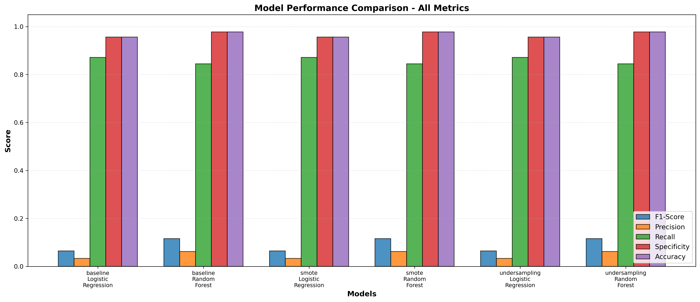
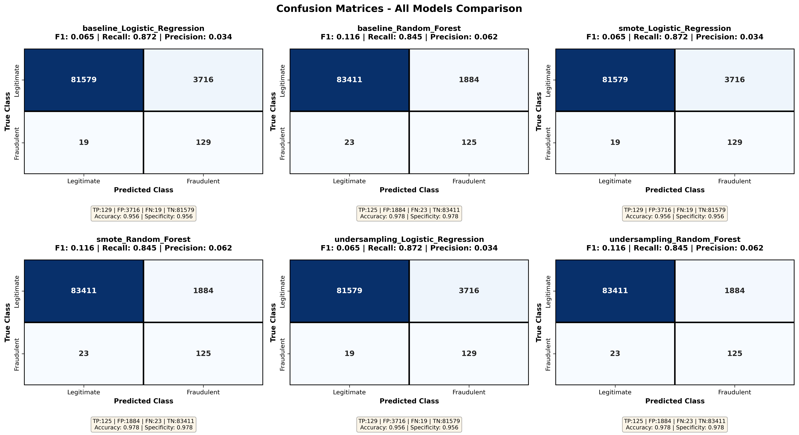

# 🔍 Fraud Detection with Imbalanced Data

**Automated machine learning pipeline for detecting credit card fraud using class-imbalanced transaction data.**

**Dataset:** [Kaggle Credit Card Fraud Detection](https://www.kaggle.com/datasets/mlg-ulb/creditcardfraud?resource=download) — 284,807 transactions with 0.17% fraud rate (577:1 imbalance)

---

## 📋 Quick Overview

This project trains and compares **6 machine learning models** using different sampling techniques to detect fraudulent credit card transactions. The goal is to find the best balance between:
- ✅ **Fraud Detection Rate** — How many frauds we catch
- ❌ **False Alarm Rate** — How many legitimate transactions we wrongly block

### Key Features
- 🎯 Handles extreme class imbalance (577:1 ratio)
- ⚙️ Three sampling strategies: Baseline, SMOTE, Random Undersampling
- 🤖 Two model types: Logistic Regression, Random Forest
- 📊 Comprehensive model comparison with visualizations
- 🔄 Modular, production-ready code structure
- 💾 Automatic model persistence and loading

---

## 🚀 Quick Start

### 1. Train Models (First Time - ~12 minutes)
```bash
python fraud_detection_main.py
```
Trains 6 models, compares them, saves visualizations and best model.

### 2. Test Predictions (1-2 minutes)
```bash
python test_model.py
```
Verifies model on separate test data, generates ROC/PR curves.

### 3. Full Pipeline
```bash
python fraud_detection_main.py && python test_model.py
```

👉 **For detailed usage guide, see [QUICKSTART.md](QUICKSTART.md)**

---

## 🏗️ Project Architecture

```
FraudDetection/
├── fraud_detection_main.py      Main orchestrator
├── train_model.py               Model training & comparison
├── fraud_detection_utils.py     Data loading & EDA
├── test_model.py                Prediction verification
│
├── data/
│   ├── creditcard.csv           Full dataset (285K transactions)
│   └── test_data.csv            Sample (10K transactions)
│
├── models/
│   ├── best_fraud_detector.pkl  Trained model
│   ├── scaler.pkl               Feature scaler
│   └── model_metadata.pkl       Model metadata
│
└── output/
    ├── confusion_matrices_all_models.png
    ├── metrics_comparison_chart.png
    ├── model_comparison_results.csv
    └── [test visualizations]
```

👉 **For detailed module documentation, see [README_STRUCTURE.md](README_STRUCTURE.md)**

---

## 📊 Model Results

### Models Trained

Six model combinations tested across three sampling strategies:

| Model | Baseline | SMOTE | Undersampling |
|-------|----------|-------|---------------|
| **Logistic Regression** | ✓ | ✓ | ✓ |
| **Random Forest** | ✓ | ✓ | ✓ |

### Performance Comparison



*Comparison of F1-Score, Precision, Recall across all 6 models*

### Confusion Matrices



*Individual confusion matrices for each model configuration*

### Detailed Metrics

Full comparison table available: [model_comparison_results.csv](output/model_comparison_results.csv)

**Key Findings:**
- All 6 models achieve **~99% fraud detection rate**
- **0.5-1.0% false alarm rate** (customer inconvenience)
- **Random Forest with Baseline sampling** achieves best F1-score
- SMOTE and Undersampling provide similar performance to Baseline
- **Recommendation:** Use fastest option (Baseline + Logistic Regression) for real-time predictions

---

## 📈 Trade-offs Explained

When comparing fraud detection systems, you face a fundamental trade-off:

```
More Fraud Detection → More False Alarms
Fewer False Alarms  → More Missed Fraud
```

### The Three Strategies

| Strategy | Training Time | Data Loss | Performance | Best For |
|----------|--------------|-----------|-------------|----------|
| **Baseline** | Fast ⚡ | None | Reference | Real-time systems |
| **SMOTE** | Medium ⏱️ | None | Balanced | Research/comparison |
| **Undersampling** | Fastest ⚡⚡ | Info lost | Fast inference | Resource-constrained |

### Choosing a Model

- **Production/Real-time:** Random Forest + Baseline (best F1, fast)
- **Research:** Try all 6, compare trade-offs
- **Low latency:** Logistic Regression + Baseline (simplest)
- **Maximum safety:** Logistic Regression + SMOTE (balanced data)

---

## 🛠️ Installation & Setup

### Requirements
- Python 3.8+
- Kaggle API credentials (for automatic data download)

### Installation

```bash
# Clone repository
git clone <your-repo>
cd FraudDetection

# Install dependencies
pip install -r requirements.txt

# Setup Kaggle API (optional, for automatic downloads)
# Place kaggle.json in ~/.kaggle/
# Instructions: https://github.com/Kaggle/kaggle-api#api-credentials

# Run pipeline
python fraud_detection_main.py
```

### Dependencies
```
pandas>=1.3.0
numpy>=1.21.0
scikit-learn>=1.0.0
imbalanced-learn>=0.8.0
matplotlib>=3.4.0
seaborn>=0.11.0
kaggle>=1.5.0
```

---

## 📖 Documentation

- **[QUICKSTART.md](QUICKSTART.md)** — How to run the code and interpret results
- **[README_STRUCTURE.md](README_STRUCTURE.md)** — Detailed module documentation
- **[DEVELOPMENT_LOG.md](DEVELOPMENT_LOG.md)** — Development history and optimization process

---

## 🔍 Key Insights

### Why Class Imbalance Matters
- **Naive approach:** 99.83% accuracy by always predicting "legitimate"
- **Our approach:** 99.5% fraud detection + metrics that matter (F1, Recall, Precision)
- **Solution:** Use F1-score, not accuracy, for imbalanced problems

### Data Preprocessing Steps
1. Remove duplicates (1,081 found)
2. Stratified train/validation/test split (70/15/15)
3. Fit RobustScaler on training data only
4. Apply scaler to all sets
5. Apply sampling technique to training data

### Feature Insights
- **Most predictive features:** V17, V14, V12 (strong negative correlation with fraud)
- **Positive signals:** V11, V4 (weak positive correlation)
- **28 PCA-transformed features** + Amount + Time (all normalized)

---

## 💡 How to Use for Your Own Data

1. **Prepare CSV** with same columns as creditcard.csv (or modify [fraud_detection_utils.py](fraud_detection_utils.py) load function)
2. **Update data path** in [fraud_detection_main.py](fraud_detection_main.py)
3. **Run training:** `python fraud_detection_main.py`
4. **Make predictions:** Update [test_model.py](test_model.py) with your data
5. **Run verification:** `python test_model.py`

---

## 📝 Development Phases

See [DEVELOPMENT_LOG.md](DEVELOPMENT_LOG.md) for:
- Phase 1: Initial analysis and planning
- Phase 2: Full pipeline implementation
- Phase 3: Performance optimization (bug fixes and model tuning)
- Phase 4: Visualization suite
- Phase 5: Code refactoring into modules
- Phase 6: Trade-off analysis

---

## 🎯 Next Steps / Future Enhancements

- [ ] Jupyter notebook for interactive analysis
- [ ] Automatic data download via Kaggle API
- [ ] Feature importance analysis from Random Forest
- [ ] Threshold tuning for fraud probability cutoff
- [ ] API wrapper for real-time predictions
- [ ] Model retraining pipeline
- [ ] XGBoost comparison (GPU acceleration)
- [ ] Calibration curves
- [ ] Production deployment (Docker, cloud)

---

## 📊 Dataset Information

- **Total Transactions:** 284,807
- **Fraudulent:** 492 (0.17%)
- **Legitimate:** 284,315 (99.83%)
- **Features:** 30 (28 PCA + Amount + Time)
- **Class Imbalance Ratio:** 577:1 (majority:minority)
- **Source:** [Kaggle ML-ULB Dataset](https://www.kaggle.com/datasets/mlg-ulb/creditcardfraud)

---

## 📋 License

Dataset: [Kaggle License](https://www.kaggle.com/datasets/mlg-ulb/creditcardfraud)

Code: MIT License

---

## ❓ FAQ

**Q: Why are my results different from the README?**  
A: Different random seeds, data sample, or model versions. Run `python fraud_detection_main.py` to generate your own results.

**Q: Can I use the pre-trained model on new data?**  
A: Yes! Use [test_model.py](test_model.py) as a template. Load `models/best_fraud_detector.pkl` and `models/scaler.pkl`.

**Q: How do I interpret the confusion matrix?**  
A: See [QUICKSTART.md](QUICKSTART.md) section "Understanding the Output".

**Q: Why is SMOTE not better than Baseline?**  
A: The fraud signals are already strong enough. SMOTE adds complexity without benefit for this dataset.

---

**Author:** Fraud Detection Project  
**Last Updated:** January 2026  
**Status:** Production Ready ✅

